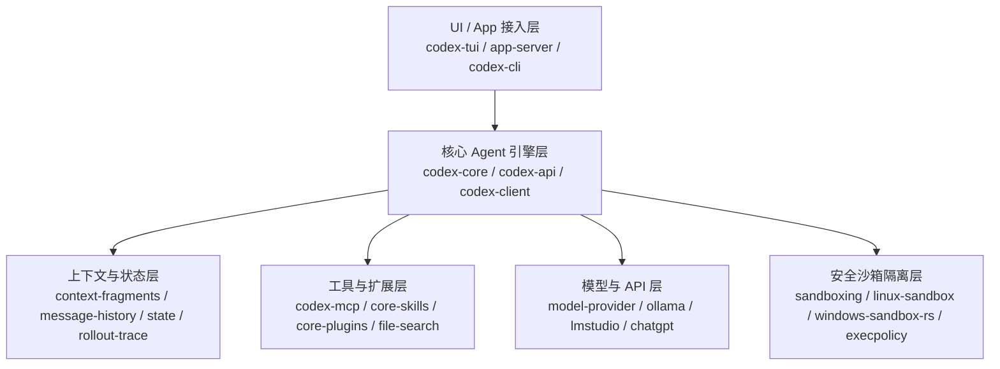

> **文档状态**：已归档  
> **更新时间**：2026-07-22  
> **工作区路径**：`d:/codex-main`  
> **修改记录**：  
> 1. `codex-rs/tui` 模块已于 2026-07-22 成功从中移除，Workspace 依赖项已同步完成清理。  
> 2. `codex-rs/app-server` 及 `codex-rs/app-server-client` 模块已于 2026-07-22 成功从中移除，Workspace 依赖项已同步完成清理。  

---

## 1. 项目概览与定位 (Project Overview)

**Codex** 是由 OpenAI 开发的高性能、跨平台 AI 编程 Agent（Coding Agent）生态系统。它既可以作为独立的本地命令行终端工具（CLI/TUI）运行，也可以作为常驻后台服务（App Server / Exec Server）接入 VS Code、Cursor、Windsurf 等 IDE 插件及桌面/Web 端应用。

### 核心技术栈
- **核心逻辑层**：Rust (包含 90+ 个专有 Crate 的 Monorepo)。
- **客户端 SDK & 发布层**：TypeScript (Node.js SDK) / Python SDK / npm 包装包。
- **构建系统**：支持 Cargo / Just 原生工作流与 Bazel 隐式依赖隔离体系。
- **通信协议**：JSON-RPC 2.0 (App Server v1/v2)、Model Context Protocol (MCP)、OpenAI Responses API。

---

## 2. 整体架构与目录拓扑 (Workspace Topology)

```text
d:/codex-main/
├── README.md                      # 项目说明与快速启动指南
├── AGENTS.md                      # 核心开发规范、代码风格与 Architecture Rules
├── justfile                       # Just 命令快捷入口 (fmt, fix, test, schema 生成)
├── BUILD.bazel / MODULE.bazel     # Bazel 根构建配置与依赖锁 (MODULE.bazel.lock)
├── package.json / pnpm-lock.yaml  # 前端/工具依赖与 pnpm workspace 配置
├── docs/                          # 项目设计与贡献文档
├── sdk/                           # 多语言 Client SDK (TypeScript & Python)
│   ├── typescript/                # TS Client SDK (供 IDE 插件/Web 导入)
│   └── python/                    # Python Client SDK
├── codex-cli/                     # npm 发布与二进制包装层
└── codex-rs/                      # [重点] 核心 Rust Monorepo (99+ 个子 Crate)
    ├── core/                      # 核心 Agent 引擎 (codex-core)
    ├── tui/                       # 终端 UI 界面 (codex-tui)
    ├── app-server/                # JSON-RPC App Server 守护进程
    ├── app-server-protocol/       # 客户端与服务端通信协议定义 (v1/v2)
    ├── sandboxing/                # 跨平台沙箱隔离抽象层
    ├── codex-mcp/                 # MCP 协议与连接管理器
    └── ...                        # 其他专有功能模块
```

---

## 3. `codex-rs` 核心引擎深度剖析

`codex-rs` 是整个 Codex 的心脏，遵循了严密的架构治理规则：

### 3.1 架构治理原则 (Architecture Principles)
1. **去膨胀化 (De-bloating `codex-core`)**：避免将所有新逻辑混入 `codex-core`。非核心逻辑积极拆分为独立的专有 Crate（如 `codex-mcp`、`execpolicy`、`rollout-trace`）。
2. **代码行数严格管控 (LoC Budget)**：单个模块控制在 500 行 LoC 以内，硬性上限不超过 800 行。
3. **零开销原生 Async Trait**：全面采用 Rust 原生 RPITIT 语法 (`fn foo(&self) -> impl Future<Output = T> + Send;`)，禁用 `#[async_trait]` 宏。

### 3.2 核心 Crate 分层架构



- **[codex-core](file:///d:/codex-main/codex-rs/core)**：
  - `ThreadManager` / `CodexThread`：维护 Turn 循环与会话状态机。
  - `ContextManager`：组装系统 Prompt、项目规范（`AGENTS.md`）与上下文片段，单项片段设置 10k Tokens 硬上限。
  - `compact.rs` / `compact_remote_v2.rs`：当历史接近 Token 限制时，自动进行增量总结与滑动窗口裁剪。
  - `mcp_tool_call.rs`：对接 MCP 工具与参数审批。
- **[sandboxing](file:///d:/codex-main/codex-rs/sandboxing)**：
  - Linux：基于 Bubblewrap (`bwrap`) 与 Namespaces 强隔离。
  - macOS：基于 Apple Seatbelt (`/usr/bin/sandbox-exec`)。
  - Windows：基于 Restricted Tokens、Job Objects 及 ACL 权限限制。
  - `execpolicy`：命令执行策略评估引擎。

---

## 4. UI 模块及其深层系统/外围接口全貌

`codex-rs/tui` 包含了丰富且深度的 Terminal UI 以及系统级接口：

### 4.1 终端主视口与交互组件
- **对话历史视口 ([chatwidget.rs](file:///d:/codex-main/codex-rs/tui/src/chatwidget.rs))**：渲染消息流、Reasoning Trace 思考链、工具调用与结果。
- **Markdown 实时渲染 ([markdown_render.rs](file:///d:/codex-main/codex-rs/tui/src/markdown_render.rs))**：支持流式语法高亮与表格探测（`table_detect.rs`）。
- **Git Patch 代码 Diff 渲染 ([diff_render.rs](file:///d:/codex-main/codex-rs/tui/src/diff_render.rs))**：精细高亮展示行级代码增删。
- **Prompt Composer ([bottom_pane/chat_composer.rs](file:///d:/codex-main/codex-rs/tui/src/bottom_pane/chat_composer.rs))**：支持多行编辑、`/` 命令补全弹窗（`command_popup.rs`）、`@` 文件搜索弹窗（`file_search_popup.rs`）。

### 4.2 高级系统与 IDE 接口 UI
1. **IDE 上下文实时抓取接口 ([ide_context.rs](file:///d:/codex-main/codex-rs/tui/src/ide_context.rs))**：
   - 通过与 IDE 通信的 IPC 管道（Windows 下使用命名管道 `windows_pipe.rs`，Unix 下使用 Domain Socket），实时抓取当前编辑器激活的文件（`activeFile`）、光标选中的代码片段（`activeSelectionContent`）和标签页列表（`openTabs`）。
2. **唤起外部编辑器 ($EDITOR) 联动 UI ([external_editor.rs](file:///d:/codex-main/codex-rs/tui/src/external_editor.rs))**：
   - 快捷键唤起系统环境变量指定编辑器（如 Vim, Nano, VS Code, Cursor）撰写超长 Prompt，保存后回传。
3. **系统原生剪贴板接口 ([clipboard_copy.rs](file:///d:/codex-main/codex-rs/tui/src/clipboard_copy.rs) / [clipboard_paste.rs](file:///d:/codex-main/codex-rs/tui/src/clipboard_paste.rs))**：
   - 跨平台读写剪贴板，支持代码块/Diff 一键复制以及富文本/大段代码粘贴。
4. **OSC 9 / OSC 777 桌面原生通知 UI ([notifications/](file:///d:/codex-main/codex-rs/tui/src/notifications))**：
   - 长任务完成时通过 ANSI 转义序列向终端发送通知，**直接触发 OS 操作系统原生桌面气泡 Notification**。
5. **OSC 8 终端可点击超链接 ([terminal_hyperlinks.rs](file:///d:/codex-main/codex-rs/tui/src/terminal_hyperlinks.rs))**：
   - 在终端内插入 OSC 8 标准超链接，支持 `Cmd/Ctrl + 鼠标左键` 直接点击打开 URL 或文件。
6. **多 Agent 协同监控 UI ([multi_agents.rs](file:///d:/codex-main/codex-rs/tui/src/multi_agents.rs))**：
   - 在并发启动多个 Subagent 时提供多视口监控，支持切换查看不同 Agent 的实时状态。

---

## 5. 外围接口支撑层 (`codex-app-server` & SDKs)

### 5.1 服务端与客户端代码分布
- **`codex-rs/app-server` (Rust)**：常驻 JSON-RPC 2.0 后台进程服务，完全在 `codex-rs/` 内部编写。
- **`codex-rs/app-server-protocol` (Rust)**：定义 v1/v2 接口数据模型，使用 `ts-rs` 自动从 Rust 代码导出 TypeScript `.d.ts` 类型。
- **`sdk/typescript` (TS)**：位于 `codex-rs/` 外部，作为客户端 SDK 库供 VS Code 插件、Cursor 扩展或 Web 端调用。

---

## 6. 构建与开发常用命令 (Developer Cheat Sheet)

工作区使用 `justfile` 统筹构建流程：

| 命令 | 说明 |
| :--- | :--- |
| `just fmt` | 自动格式化 Rust、Python、Bazel、JSON 等所有文件 |
| `just fix -p <crate>` | 针对指定 Crate 自动修复 Clippy 问题 |
| `just test -p <crate>` | 运行指定 Crate 的单元与集成测试 |
| `just write-config-schema` | 重新生成并更新 `config.schema.json` |
| `just write-app-server-schema` | 重新生成并更新 App Server Protocol Schema |
| `cargo insta pending-snapshots -p codex-tui` | 查看 TUI 快照测试变更 |
